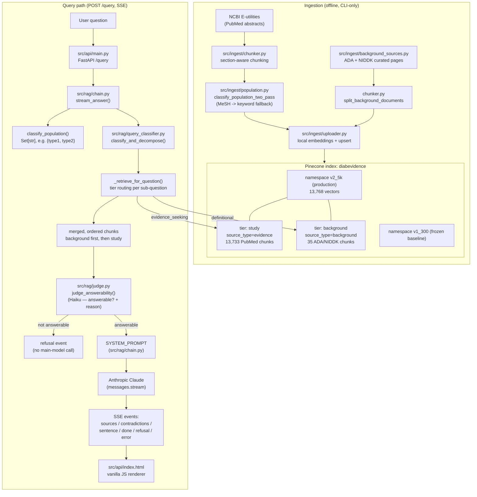
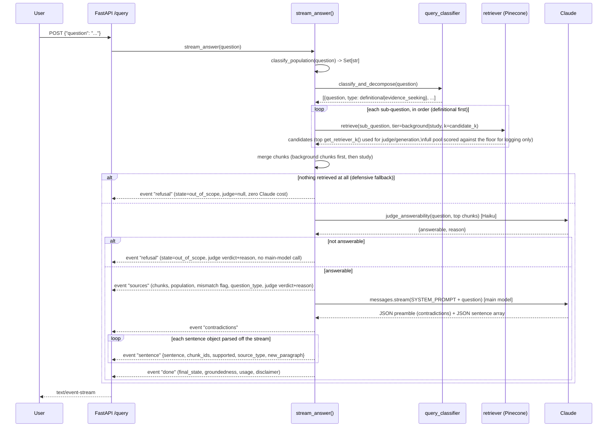

# DiabEvidence — Architecture

This is the current-state reference for how DiabEvidence retrieves and answers questions. It supersedes the older architecture description in the repo root `README.md` where the two disagree — this document reflects the system after the namespace fail-fast fix, the two-tier (background/study) retrieval split, query classification and decomposition, and the multi-population classifier fix (2026-09).

## 1. System overview

## 2. Query lifecycle (sequence)

## 3. Component reference

### Ingestion (offline, never runs on request)

| File | Responsibility |
|---|---|
| `src/ingest/pubmed.py` | NCBI E-utilities client — search, fetch, parse abstracts + MeSH terms |
| `src/ingest/chunker.py` | Section-aware word chunking for PubMed abstracts; paragraph chunking for background pages. Tags every chunk `source_type` explicitly at chunk time (`"evidence"` for PubMed, `"background"` for ADA/NIDDK) — this field must exist in Pinecone metadata for tier-filtered retrieval to work; a value defaulted only in Python code is invisible to a Pinecone filter |
| `src/ingest/population.py` | `classify_population(text) -> Set[str]` — multi-population-aware (query time); `classify_population_single`/`classify_population_two_pass` — single-tag convention (document tagging, unchanged) |
| `src/ingest/background_sources.py` | Curated ADA Standards of Care + NIDDK patient-education text (13 documents: diabetes types, diagnosis, nutrition therapy, glycemic targets, general management) |
| `src/ingest/uploader.py` | Local embedding (`fastembed`/ONNX, `all-MiniLM-L6-v2`, 384-dim, free) + batched Pinecone upsert, namespace-aware |
| `src/ingest/freeze.py` | Corpus provenance manifest (`data/corpus_manifest*.json`) |

### Retrieval

| File | Responsibility |
|---|---|
| `src/rag/retriever.py` | `retrieve()` — embeds the question, queries Pinecone, optionally filtered to one tier (`tier="background"` or `"study"`/`"evidence"`) via a Pinecone metadata filter on `source_type`. `decide_retrieval_state()` — pure scoring over a candidate pool against the similarity floor; kept for the retrieval inspector's score distribution, no longer the abstain gate (see Answerability judge, below). `get_namespace()` defaults to `v2_5k`; `validate_namespace()` fails the app's startup if the resolved namespace is missing or empty — no silent fallback to another namespace |
| `src/rag/query_classifier.py` | Pure heuristic (no LLM call): `classify_question_type()` (definitional vs. evidence-seeking), `decompose_compound()` (splits a genuinely compound question into sub-questions, without splitting a compound *subject* like "type 1 and type 2 diabetes" into two questions), `classify_and_decompose()` (both, sub-questions ordered definitional-first) |
| `src/rag/chain.py` `_retrieve_for_question()` | Runs each sub-question's retrieval against its own tier only, takes the top `get_retriever_k()` candidates by raw score (regardless of floor survival) from each, merges and de-duplicates them, preserving background-first ordering so the excerpt list Claude receives is already in the order the answer must follow. Also scores the full candidate pool against the floor purely for score-distribution logging |
| `src/rag/judge.py` `judge_answerability()` | **Answerability judge** (replaces the floor as the abstain gate). Sends the question + top retrieved chunks to a small model (`ANTHROPIC_JUDGE_MODEL`, default `claude-haiku-4-5`) asking whether they actually answer the question, not just relate to it topically — see `docs/findings-retrieval-floor.md` for why the floor alone can't do this. Always returns `{answerable, reason}`; a malformed response or API failure defaults to `answerable: false` (logged), never falls through to generation ungoverned |

### Generation

`src/rag/chain.py`'s `SYSTEM_PROMPT` (direct Anthropic SDK, no framework) enforces, in priority order:
1. Answer only from the excerpts given — never outside/training knowledge.
2. A `background`-tier excerpt may only support definitional sentences, never a research claim.
3. Output is a JSON array of `{sentence, chunk_ids, supported, new_paragraph}` objects — citation attribution is structural (`chunk_ids`), never inline `[PMID: ...]` text.
4. A JSON contradiction-check preamble runs over `study`-tier excerpts only, before the sentence array.
5. **Lead with the direct answer; every caveat (population mismatch, an unanswerable part, low confidence) comes after it, never before.** When the question was split into parts, answer the definitional part first, then what the studies show.
6. Population-mismatch flag: fires only when the question names a population the retrieved evidence doesn't cover at all — a `"mixed"` (general) retrieval counts as covering everything asked.
7. If no excerpt answers a specific claim, say so in exactly one plain closing sentence — never a preamble, and never skipped just because a definitional part *was* answered.
8–10. No fabrication; medication discussion is informational-only, never dosing/prescribing; prefer specific numbers from `study` excerpts.

### API & frontend

| File | Responsibility |
|---|---|
| `src/api/main.py` | FastAPI app. `lifespan` validates the Pinecone namespace at startup (fails fast) and logs the resolved namespace + vector count once. `/health` reports `namespace`/`namespace_vector_count`; `/query` streams SSE |
| `src/api/index.html` | Single-file vanilla HTML/CSS/JS (no build step). Journal-style type system (Source Serif 4 / Source Sans 3 / IBM Plex Mono). A fully-grounded answer gets **no** confidence badge — only degraded states (low confidence, population mismatch, contradiction) are visually flagged, so the UI never looks more confident than the evidence supports. Citations render as separate `[1] [2]` monospace markers (click/hover to jump to the source), not a permanent colored underline. Paragraph breaks follow the model's `new_paragraph` flag. The medical disclaimer is a persistent footer, not repeated per answer |

### Evaluation

| File | Responsibility |
|---|---|
| `eval/eval_set_v2.json` | Frozen 43-question set: 24 in-scope (evenly split across the 4 indexed topics) + 17 diabetes-adjacent-off-topic + 2 fully-unrelated, each with a hand-written ground-truth reference answer |
| `scripts/run_eval_v1.py` | Runs an eval set against a namespace; `--retrieval-only` and `--rerank` modes cost nothing (Pinecone + local embeddings/cross-encoder only). The full-pipeline mode now also records `top_score`/`judge_verdict`/`judge_reason` per question and, when a cached retrieval-only baseline file is available, a summary section comparing the old floor-only gate against the new judge gate (correct refusals / false rejects / false accepts for each) |
| `scripts/smoke_test_v2_5k.py` | Minimal 3-query smoke test proving the generation path works, with real token/cost reporting |
| `src/rag/reranker.py` | Local ONNX cross-encoder (no API cost) — tried as a fix for "similarity floor can't separate in-scope from diabetes-adjacent-off-topic questions"; it doesn't fix it (documented finding, below) |

## 4. Known open items

- **Similarity floor cannot gate diabetes-adjacent-but-off-topic questions** (e.g. "what treats diabetic retinopathy") — confirmed at n=17, and a cross-encoder reranker doesn't fix it either. Both are solid domain gates (diabetes vs. not) but not topic gates (the 4 indexed topics vs. diabetes-adjacent content). Full write-up, with re-verified numbers: [`docs/findings-retrieval-floor.md`](findings-retrieval-floor.md). **Fix implemented (2026-09-26): `src/rag/judge.py`** replaces the floor as the abstain gate with an LLM answerability check (see the Answerability judge component above and in `README.md`). Not yet validated end-to-end against `eval/eval_set_v2.json` with real generation — the Anthropic API key behind this project had a zero credit balance as of 2026-09-16 (any live Claude call, including the judge's, fails with a billing error until that's resolved); `scripts/run_eval_v1.py`'s new old-vs-new comparison section is ready to run once credit is confirmed available.
- **The `new_paragraph` and tier-routing/decomposition prompt behavior have not been verified against a live Claude response** as of this writing — they were implemented and unit-tested without calling the Anthropic API (per the task that introduced them), so the *code path* is verified but the *model's actual compliance* with the new formatting/ordering rules is not yet confirmed by a real generation.
- **`docs/ARCHITECTURE.md` (this file) vs. `README.md`**: the README's "Architecture" section predates the two-tier renaming (`evidence`→`study` display label), query classification/decomposition, and the multi-population classifier fix. Treat this file as authoritative until the README is updated to match.

## 5. Recommended follow-on documents (not yet written)

- **`docs/DATA_SCHEMA.md`** — the full Pinecone metadata schema per tier (field names, types, which are guaranteed present vs. optional), since two real bugs this session (`source_type` missing on study-tier chunks, single-population tagging convention) came from metadata schema assumptions that were never written down in one place.
- **`docs/RUNBOOK.md`** — namespace management runbook: how to stand up a new namespace, how `validate_namespace()`'s fail-fast startup check behaves in production, what to do when it fires.
- **`docs/EVAL_METHODOLOGY.md`** — consolidates the reasoning behind `eval/eval_set_v1.json` vs `v2.json`, the retrieval-only/rerank findings, and what "in-scope" vs "diabetes-adjacent-off-topic" means for grading — currently scattered across commit messages and this conversation.
- **`CONTRIBUTING.md`** — none exists yet; useful once more than one person touches this repo (commit message conventions are already fairly established in `git log` — worth codifying).
